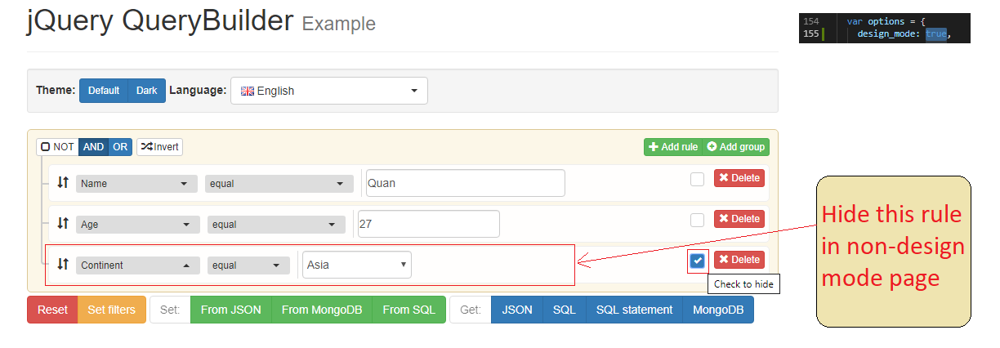

# jQuery QueryBuilder

[](https://www.npmjs.com/package/jQuery-QueryBuilder)
[](https://www.jsdelivr.com/package/npm/jQuery-QueryBuilder)
[](https://travis-ci.org/mistic100/jQuery-QueryBuilder)
[](https://coveralls.io/r/mistic100/jQuery-QueryBuilder)
[](https://david-dm.org/mistic100/jQuery-QueryBuilder)

jQuery plugin offering an simple interface to create complex queries.

[](https://querybuilder.js.org)

## Documentation
[querybuilder.js.org](https://querybuilder.js.org)

### Dependencies
 * [jQuery 3](https://jquery.com)
 * [Bootstrap 3](https://getbootstrap.com/docs/3.3) (CSS only)
 * [jQuery.extendext](https://github.com/mistic100/jQuery.extendext)
 * [doT.js](https://olado.github.io/doT)
 * [MomentJS](https://momentjs.com) (optional, for Date/Time validation)
 * [SQL Parser](https://github.com/mistic100/sql-parser) (optional, for SQL methods)
 * Other Bootstrap/jQuery plugins used by plugins

($.extendext and doT.js are directly included in the [standalone](https://github.com/mistic100/jQuery-QueryBuilder/blob/master/dist/js/query-builder.standalone.js) file)

### Run

Install Node dependencies `npm install` then run `grunt` in the root directory to generate production files inside `dist`.

#### Options for show/hide feature

You can add feature show hide rule without missing rule in sql generate :
```bash
# set "design_mode": true to declare design mode for QueryBuilder (we use it in design condition page)
# set "design_mode": false to declare design mode for QueryBuilder (we use it in non design page)
	var options = {
    design_mode: true,
	... }
	
	$('#builder').queryBuilder(options);
```


#Design page


#Non-Design page
#### Other commands

 * `grunt build` to build a standalone builder.
 * `grunt serve` to open the example page with automatic build and livereload.
 * `grunt doc` to generate the documentation.


## License
This library is available under the MIT license.
